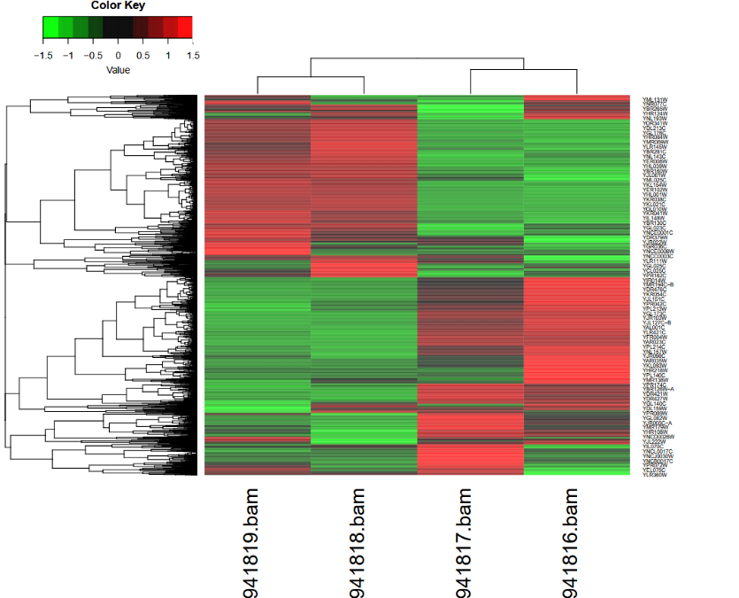

## Introduction

 Yeasts are widely used for their capabilities of ethanol and $CO_2$ production. Therefore, this project is focused on properties of yeast cell metabolism during fermentation processes. RNA-seq is a standard method to make transcriptome profiles for measurement of genome feature abundance. The search of differentially expressed genes is one of the major applications of transcriptome profiling. The genes showing differences in expression level between conditions are associated with effects of these conditions. 
 Thus, to examine the exact changes switching respiration and fermentation in yeasts, RNA expression profiles are studied.

## Get the data
To begin the RNA-seq analysis yeast reads, genome and annotation are needed.

yeast reads:
- [SRR941816](ftp.sra.ebi.ac.uk/vol1/fastq/SRR941/SRR941816/SRR941816.fastq.gz): fermentation 0 minutes replicate 1 (413 Mb)

- [SRR941817](ftp.sra.ebi.ac.uk/vol1/fastq/SRR941/SRR941817/SRR941817.fastq.gz): fermentation 0 minutes replicate 2 (455 Mb)

- [SRR941818](ftp.sra.ebi.ac.uk/vol1/fastq/SRR941/SRR941818/SRR941818.fastq.gz): fermentation 30 minutes replicate 1  (79.3 Mb)

- [SRR941819](ftp.sra.ebi.ac.uk/vol1/fastq/SRR941/SRR941819/SRR941819.fastq.gz): fermentation 30 minutes replicate 2  (282 Mb)

As a reference genome we will use , in the genome database at NCBI. Make sure you have strain S288c and assembly R64. Download the reference genome in FASTA format and annotation in GFF format.

Reference genome is _Saccharomyces cerevisiae_, strain S288c and assembly R64.  

- reference genome file ([fna](ftp.ncbi.nlm.nih.gov/genomes/all/GCF/000/146/045/GCF_000146045.2_R64/GCF_000146045.2_R64_genomic.fna.gz))

- annotation file ([gff](ftp.ncbi.nlm.nih.gov/genomes/all/GCF/000/146/045/GCF_000146045.2_R64/GCF_000146045.2_R64_genomic.gff.gz))

## Alignment and feature counts

Make new environments, the final .yaml files is applied to this report.

Install [HISAT2](https://daehwankimlab.github.io/hisat2/), [gffread](https://anaconda.org/channels/bioconda/packages/gffread/overview) in one of these venvs, and  [kallisto](https://pachterlab.github.io/kallisto/about).

```
conda create -n rnaseqHISAT -c conda-forge -c bioconda hisat2 gffread

conda create -n rnaseqkallisto -c conda-forge -c bioconda kallisto

```
### HISAT2 alignment
Unzip genome and annotations.

Build index:
```
hisat2-build raw_reads/GCF_000146045.2_R64_genomic.fna index/yeast
```

Then run algorithm in single-end mode and make bams:
```
hisat2 -p 8 -x index/yeast -U SRRXXXXXX.fastq -S SRRXXXXXX.sam
samtools sort -@ 8 -o SRRXXXXXX.bam SRRXXXXXX.sam
```

### Quantify with featureCounts

Convert .gff to .gtf before running featureCounts:

```
gffread raw_reads/GCF_000146045.2_R64_genomic.gff -T -o annotation.gtf

```

Run featureCounts (not all rows include gene_id (2 of 19716, so we drop them)) and simplify output then:
```
grep "gene_id" annotation.gtf > clean_anno.gtf
featureCounts -g gene_id -a clean_anno.gtf -o fcounts.txt SRR941816.bam SRR941817.bam SRR941818.bam SRR941819.bam
```
`fcounts.txt.summary` is placed in `results` folder.

We don’t need all columns from featureCounts output file for further analysis, so let’s simplify it.

```
cat fcounts.txt | sed '1!s/^gene-//' | cut -f1,7-10 > results/simple_fcounts.txt
```
Output:
```
# Program:featureCounts v2.1.1; Command:"featureCounts" "-g" "gene_id" "-a" "clean_anno.gtf" "-o" "fcounts.txt" "SRR941816.bam" "SRR941817.bam" "SRR941818.bam" "SRR941819.bam" 
Geneid	SRR941816.bam	SRR941817.bam	SRR941818.bam	SRR941819.bam
YAL068C	14	16	2	6
YAL067W-A	0	0	0	0
YAL067C	116	69	5	11
...
```
## Differential expression analysis

Install R dependencies for [DESeq2](https://bioconductor.org/packages/release/bioc/html/DESeq2.html):

```
install.packages("BiocManager")
BiocManager::install("DESeq2")
```

Use the following R scripts:

* `make_dataset.R`: This file includes installation of DESeq2 package and makes dataframe to work with.

* `deseq.R`: This file transforms our data to DESeqDataSet, runs analysis, writes sorted results to the file `result.txt`. Also prepares normalized count matrix for visualisation step.

* `visualisation.R`: Builds heatmap via Z-score for each gene. Saves in pdf format.




## Interpretation and discussion

Extract top-50 instances from `result.txt` file where they are sorted by adjusted p-value:

```
head -n 52 result.txt | cut -f 1 | cut -d "-" -f 2 > genes.txt
```
Use https://www.yeastgenome.org/goSlimMapper and match Gene Ontology (GO) terms tto the chosen genes.

Results are stored in GO.html table in `results` folder.
There are 35 GO terms in total, indicating changes in main processes within yeast cells during fermentation process.

Pick genes with increased and decreased expression and describe them.

### Upregulated genes

One of the most obvious differences is assaociated with transmembrane transport `GO:0055085`. 
The fermenatation is tied to rearrangements of metabolic pathways, therefore, cells require adaptation of transmembrane delivery for the changed metabolites and protection from increasing ethanol concentration outside. 

It involves the following genes:

* [YDR536W](https://www.yeastgenome.org/locus/YDR536W): 7.88 log2-change, encodes a plasma membrane-bound glycerol/$H^+$ symporter responsible for glycerol uptake, induced when cells are subjected to osmotic shock.
* [YHR094C](https://www.yeastgenome.org/locus/YHR094C): 7.88 log2-change, low-affinity glucose transporter, is induced in presence of glucose and repressed in its deficiency.
* [YNL065W](https://www.yeastgenome.org/locus/YNL065W): 7.79 log2-change, amino acid plasma membrane transporter, plays role in decreasing cytosole accumulation of amino acids, to help cells surviving excess amino acid toxicity. 
* [YKL120W](https:/mot/www.yeastgenome.org/locus/YKL120W): 7.27 log2-change, mitochondrial inner membrane transporter, mainly transports oxaloacetate into the mitochondrial matrix and exports alpha-isopropylmalate from it. Enhanced during increased glucose metabolism.

### Downregulated genes

In top-50 genes there are only two downregulated genes.

* [YLR327C](https://www.yeastgenome.org/locus/S000004319): -5 log2-change (~ -97%), this gene encodes protein of unknown function associated with ribosomes.

* [YKR097W](https://www.yeastgenome.org/locus/S000001805): -4.7 log2-change (~ -96%), carbohydrate metabolic process (`GO:0005975`).
Phosphoenolpyruvate carboxykinase, located in cytosol. Catalyzes early reaction in carbohydrate biosynthesis. Presence of glucose inhibts transription and increases mRNA degradation. As this gene is involved in gluconeogenesis, process of glucose production, it is strongly suppresed while cells have unlimited glucose intake and active glucose utilisation is activated.
